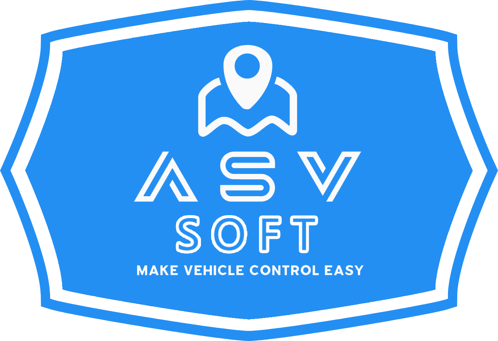

 

# **Asv.Drones.Gui.Plugin.FlightDocs**

**Asv.Drones.Gui.Plugin.FlightDocs** stands as a prime example of an open-source plugin implementation for the Asv.Drones.Gui project.

## There is a section in our documentation dedicated to this plugin - [Plugins development](https://docs.asv.me/product-guides/plugins-development)

This illustrative plugin serves as a showcase, offering insights into the intricate art of extending the capabilities of the parent application. Its primary aim is to familiarize users with the fundamental intricacies of crafting their very own plugins and the vast potential they hold.

In this instructive endeavor, you will discover how to empower your interface with action buttons under the "Actions" banner on the map page, create custom widgets and even design custom control elements that align with your unique vision. Furthermore, it delves into the key elements of constructing services and the pivotal role providers play in these service-oriented extensions.

The project's file structure, meticulously crafted to emulate that of the primary `Asv.Drones.Gui` project, is not a mere coincidence. Rather, it is a deliberate choice, as this structured approach proves most advantageous for the development and upkeep of open-source plugins meant to enrich the functionality of the core application.

## How to build

Make sure the next components are installed: 
* .NET SDK 8 - https://dotnet.microsoft.com/en-us/download/dotnet/8.0
* AvaloniaUI Templates - https://docs.avaloniaui.net/docs/get-started/install
* Avalonia XAML development - https://docs.avaloniaui.net/docs/get-started/set-up-an-editor 

After you installed all of these, you need to follow the steps:

1. Open terminal and clone this repository using `git clone git@github.com:asv-soft/asv-drones-gui-plugin-flight-docs.git` command (URL may be different);
2. Open the cloned repository folder using `cd asv-drones-gui-plugin-flight-docs`;
3. Then you need to restore NuGet packages in a plugin project with `dotnet restore`, `nuget restore` or through IDE;
4. Finally - try to build your project with `dotnet build` or through IDE. 

## How to use

After building the source code of the plugin project, the final library should be placed in the directory of the already built `Asv.Drones.Gui` application, the next time you launch the application CompositionContainer will see the library and add it to the common list of libraries loaded at startup.